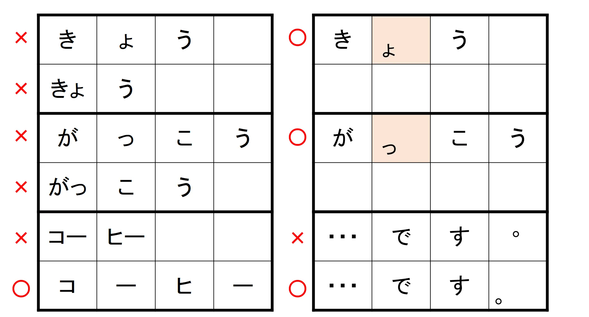
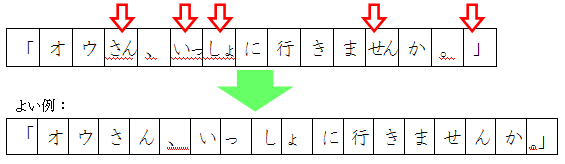
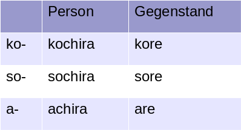
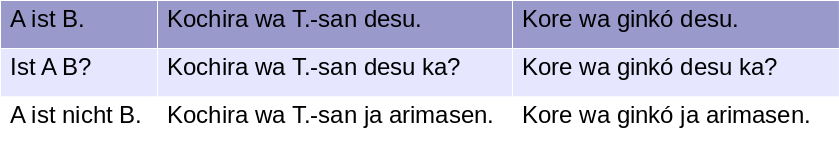
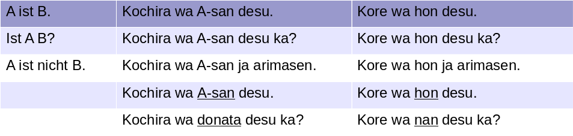

# 第1章 

## {data-background-image="./Medien/onsen.jpg"}

##
(Beispielfolien)

## {data-background="https://media.giphy.com/media/l2Sq8oTACVkhZ9pE4/giphy.gif"}
Bitte gut aufpassen!

## おげんき　です　か
~~~
Ogenki desu ka?  
  Hai, genki desu.  
  Iie, genki  ja/dewa  arimasen.  
  Iie, byóki desu.  
~~~

## きょう　の　かんじ   
才(sai) 

|一|二|三|四|五|六|七|八|九|十|
|---|---|---|---|---|----------|---|---|---|---|
|一|二|三|四|五|六|七|八|九|十|
|一才|二才|三才|四才|五才|六才|七才|八才|九才|十才|
|十一才|十二才|十三才|十四才|十五才|十六才|十七才|十八才|十九才|二十才|

## ひらがな　一
{ width=100% }

## ひらがな　二
{ width=100% }

## 
{ width=100% }

## Demonstrativpronomen I
{ width=100% }

## 　なに（なん）

{ width=100% }

## Dialoge

~~~
was: nani (nan)    nan  i   +   t, d, n
                            Kore  wa  nan  i    desu  ka?

Kore wa hon desu.
Kore wa nan desu ka?

Buch wa nihongo de hon desu.
Buch wa nihongo de nan desu ka?

~~~

## れんしゅうもんだい　一

{ width=20% }
{ width=20% }
{ width=20% }
{ width=20% }
{ width=20% }
{ width=20% }
{ width=20% }

# 第2章 

## {data-background-image="./Medien/ramen.jpg"}
Hmm. Lecker.

## 
(Medien)

## Abspielen Audioschnippsel 

Tondatei automatisch abspielen, wenn die Folie geöffnet wird.  
Atmosphäre auf einem japanischen Bahnhof.

<video data-autoplay src="./Medien/station_announcement.mp3">

## Video einspielen
Ein Video wird abgespielt, wenn die Folie geöffnet wird.

<video data-autoplay src="http://clips.vorwaerts-gmbh.de/big_buck_bunny.mp4">

## Video mit iframe
<iframe width="854" height="480" src="https://www.youtube.com/watch?v=dUyMEgvjJjw" frameborder="0" allowfullscreen></iframe>

##
Grafik einbauen.
{ width=100% }

## Video einspielen

Video einspielen mit Steuerung.

<video src="./Medien/Mikado.mp4" width=640 height=480 controls>

## Video einspielen <video data-autoplay src="./Medien/Mikado.mp4" width=640 height=480 controls>

Video läuft im Hintergrund.

## Tondatei einspielen

Audiodatei einspielen mit Kontrollmöglichkeiten (wiederholen, Lautstärke,
überspringen)

<audio controls>
  <source src="./Medien/shamisen.mp3" type="audio/mpeg">
Sorry - Ihr Browser hat keine Unterstützung für dieses Audio-Format.
</audio>

## Musikinstrumente Japans

Audiodatei einspielen, sobald Folie aufgerufen wird.

<video data-autoplay src="./Medien/shamisen.mp3">

# 第3章 

## {data-background-image="./Medien/cityscapes.jpg"}
	
##
(Textformatierung)

## 
Mithilfe der Ruby-Funktion können Lesehilfen eingefügt werden.
 
昔、<ruby>千葉 <rp>(</rp><rt>Chiba</rt><rp>)</rp></ruby>に住んでいました.

昔、<ruby>千葉 <rp>(</rp><rt>ちば</rt><rp>)</rp></ruby>に住んでいました.

## Zweispaltig

:::::::::::::: {.columns}
::: {.column width="40%"}
Hier  
steht ein Texter im Wasser.  
Hier steht ein Text. Hier steht ein Text. 
:::
::: {.column width="60%"}
Auf  
der rechten Seite geschieht das ebenfalls. Auf der rechten Seite ebenfalls. Auf der rechten Seite ebenfalls.
:::
::::::::::::::

## Definitionen

reaveal.js

:   Ein Tool, mit dem Präsentationen erstellt werden können.
:   Alternative zum Programm PowerPoint.

kuruma

:   Auto
:   Rad

## 

Hakodate (Landeskunde Japan)

~~~
Hakodate zählt zu den größten Städten auf Hokkaido, der nördlichsten Insel Japans. Über der Stadt erhebt sich der 334 m hohe gleichnamige Berg Hakodate. Vom Gipfel, auf den eine Seilbahn führt, bietet sich nachts ein spektakulärer Panoramablick. 
~~~

Am Fuße des Berges liegt das Viertel Motomachi mit steilen Straßen und Gebäuden, die zu Beginn des 20. Jh. im westlichen Stil erbaut wurden. Ein Wahrzeichen der Stadt ist die prächtige alte Stadthalle von Hakodate aus dem Jahr 1910. 

## Einfache Tabellen

Bezeichnung | Typ | Preis pro Stück
:--|:--:|--:
Koffer | B | 3.495,60
Tasche | C | 25,99

## Aufblenden

(Beispiel Aufblenden)

::: incremental
- Katakana
- Hiragang
- Kanji
- Romaji
:::

## Aufblenden II
::: incremental

あなた

わ

誰

です

か。

:::

## Aufblenden II
::: incremental

あなた

わ

誰

です

か。

:::

## Gliederung 1
* Apfel
* Birne
  - Am Fuße des Berges liegt das Viertel Motomachi mit steilen Straßen und Gebäuden, die zu Beginn des 20. Jh. im westlichen Stil erbaut wurden. Ein Wahrzeichen der Stadt ist die prächtige alte Stadthalle von Hakodate aus dem Jahr 1910. 
    + Zitrone
    + Zwiebel
  - Kokosnuss
* Pflaume

## Gliederung 2

#. Watashi **wa** 23-sai **desu**.
#. Mori-san **wa** 21-sai **desu**.
   +  Anata wa?
#. Am Fuße des Berges liegt das Viertel Motomachi mit steilen Straßen und Gebäuden, die zu Beginn des 20. Jh. im westlichen Stil erbaut wurden. Ein Wahrzeichen der Stadt ist die prächtige alte Stadthalle von Hakodate aus dem Jahr 1910. 

## Hervorhebung
>  Hervorgehobener Textabschnitt, 
z. B. Zitate usw.

>>  Eine Etage tiefer

>  Und weiter

# 第4章 

## Straße in Gion {data-background-image="./Medien/gion.jpg"}

##
(Cloud-Computing)

## Trotner-Cloud

Bitte hier <https://nextcloud.trotner.de> oder [hier](<https://nextcloud.trotner.de>) klicken.

## Public Links

Beispiel: Download oder Anhören einer Tondatei mit Entspannungsübungen

[Hier klicken](<https://nextcloud.trotner.de/index.php/s/PgTFAPWCjQBZ4pQ>) um
die Tondatei von der Trotner-Cloud herunterzuladen.

##
(Trotner-Moodle)

Bitte hier <https://moodle.trotner.de> oder [hier](<https://moodle.trotner.de>) klicken.

# Danksagung
## Vielen Dank für Ihre Aufmerksamkeit!

Ikuko Takeuchi-Trotner

HAW Landshut

